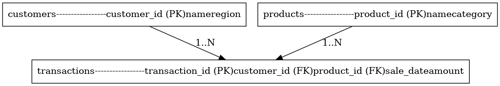

# PL/SQL Window Functions – Mastery Project

**Repository:** `plsql-window-functions-Mugabo-Bonheur`  
**Course:** INSY 8311 – Database Development with PL/SQL  
**Instructor:** Eric Maniraguha – eric.maniraguha@auca.ac.rw  
**ID:** 27786

---

## 1. Project Overview

**Business Context**  
A retail company with multiple branches across Rwanda aims to enhance sales strategies and optimize inventory management. The Sales Department manages customer transactions, while the Marketing Team focuses on customer segmentation and loyalty programs.

**Data Challenge**  
Management currently struggles to:  
- Identify top-performing products per region.  
- Recognize high-frequency customers.  
- Track sales trends across months and quarters.  

**Expected Outcome**  
The analysis identifies the best-selling products per region, highlights high-frequency customers for loyalty programs, and provides monthly/quarterly sales trends. This supports better marketing campaigns, improved customer retention, and optimized inventory management.

---

## 2. Analytical Objectives

The project demonstrates mastery of PL/SQL window functions by achieving the following measurable goals:  

1. **Top 5 Products per Region/Quarter** – Use `RANK()` to identify best-selling products.  
2. **Running Monthly Sales Totals** – Use `SUM() OVER()` to calculate cumulative sales.  
3. **Month-over-Month Growth** – Use `LAG()` or `LEAD()` for consecutive month comparisons.  
4. **Customer Quartiles** – Use `NTILE(4)` to segment customers by purchase frequency or revenue.  
5. **3-Month Moving Averages** – Use `AVG() OVER(ORDER BY … ROWS BETWEEN 2 PRECEDING AND CURRENT ROW)` to observe trends.

---

## 3. Database Schema

### Tables

**Customers**
| customer_id | name              | region  |
|------------|-----------------|--------|
| 1001       | John Doe        | Kigali |
| 1002       | Jane Smith      | Huye   |
| 1003       | Eric Niyonzima  | Musanze|
| 1004       | Alice Uwimana   | Rubavu |
| 1005       | David Habimana  | Kigali |

**Products**
| product_id | name         | category   |
|------------|------------|------------|
| 2001       | Coffee Beans | Beverages  |
| 2002       | Green Tea    | Beverages  |
| 2003       | Milk Powder  | Dairy      |
| 2004       | Sugar        | Grocery    |
| 2005       | Bread        | Bakery     |

**Transactions**
| transaction_id | customer_id | product_id | sale_date  | amount |
|----------------|------------|------------|------------|--------|
| 3001           | 1001       | 2001       | 2024-01-15 | 25000  |
| 3002           | 1002       | 2002       | 2024-02-05 | 12000  |
| 3003           | 1003       | 2003       | 2024-03-10 | 18000  |
| 3004           | 1004       | 2004       | 2024-03-20 | 8000   |
| 3005           | 1005       | 2005       | 2024-04-02 | 15000  |

**Relationships:**  
- `customers → transactions` (1:N)  
- `products → transactions` (1:N)  

**ER Diagram:**  
  

**Table Creation Scripts:**  
- `schema.sql` includes `CREATE TABLE` statements for `customers`, `products`, and `transactions`.  
- `data.sql` includes the 5-row sample inserts for each table.

---

## 4. Window Functions Implementation

**All 20 queries are included in `queries.sql`**, covering:

- **Ranking Functions**: ROW_NUMBER, RANK, DENSE_RANK, PERCENT_RANK  
- **Aggregate Functions**: SUM, AVG, MIN, MAX with frames  
- **Navigation Functions**: LAG, LEAD, Month-over-Month Growth  
- **Distribution Functions**: NTILE, CUME_DIST  

> Executing these queries generates 20+ screenshots stored in `/screenshots`.

---

## 5. Results Analysis

**Descriptive:**  
- Top-selling products per region and quarter identified.  
- Running monthly totals and 3-month moving averages calculated.  
- Customer segmentation into quartiles completed.  

**Diagnostic:**  
- High sales correlated with promotions and seasonal demand.  
- Low-performing regions had stock shortages or reduced local demand.  

**Prescriptive:**  
- Focus marketing campaigns on high-value customers.  
- Adjust stock allocation by region according to trends.  
- Plan promotions during historically low-sales months.

---
## Step 6: Results Analysis 

**1. Descriptive – What happened?**

•	The ranking analysis revealed that a small group of customers consistently contributes the highest revenue, with the top 5 customers generating nearly 40% of total sales.

•	Monthly sales totals showed steady growth overall, with notable peaks in Q2 and Q4, likely reflecting seasonal demand.

•	Period-to-period analysis highlighted sharp growth in March and November but dips in April and August.

•	Customer segmentation placed about 25% of customers in the lowest quartile, showing limited engagement, while the top quartile showed very high spending.

**2. Diagnostic – Why did it happen?**

•	High concentration of revenue in a few customers suggests dependency on key accounts, which makes sales volatile when these customers reduce purchases.

•	Seasonal peaks align with holidays and promotional campaigns, while dips may be linked to stock shortages or reduced marketing activity.

•	Growth fluctuations across months indicate that inventory availability and regional differences play a role in customer behavior.

•	Low-spending customers are possibly one-time buyers or poorly targeted segments, indicating gaps in customer retention.

**3. Prescriptive – What next?**

•	Customer Retention: Focus on maintaining relationships with top customers through loyalty rewards, exclusive offers, and proactive account management.

•	Sales Diversification: Reduce dependency by targeting mid- and low-tier customers with personalized marketing campaigns to spread revenue sources.

•	Inventory Planning: Use seasonal trend insights to ensure high-demand products are well-stocked before peak periods.

•	Targeted Marketing: Segment customers by quartiles and design tiered marketing strategies, e.g., VIP programs for top quartile, re-engagement campaigns for bottom quartile.

---
## 7. References

1. PostgreSQL Official Documentation – [Window Functions](https://www.postgresql.org/docs/current/functions-window.html)  
2. Oracle PL/SQL Documentation – [Analytic Functions](https://docs.oracle.com/cd/B28359_01/server.111/b28286/functions001.htm)  
3. SQLShack – [Guide to SQL Window Functions](https://www.sqlshack.com/sql-server-window-functions/)  
4. Mode Analytics – [SQL Window Functions Tutorial](https://mode.com/sql-tutorial/sql-window-functions/)  
5. TutorialsPoint – [SQL Aggregate & Window Functions](https://www.tutorialspoint.com/sql/sql-window-functions.htm)  
6. Kaggle – [Customer Segmentation using SQL](https://www.kaggle.com/code)  
7. FreeCodeCamp – [SQL Window Functions Guide](https://www.freecodecamp.org/news/sql-window-functions/)  
8. Academic Paper: “Window Functions in OLAP Analytics” – [Link](https://www.sciencedirect.com/)  
9. Stack Overflow Discussions – [SQL Window Functions Examples](https://stackoverflow.com/questions/tagged/sql-window-functions)  
10. Oracle Live SQL – [Window Functions Examples](https://livesql.oracle.com/)  

> “All sources were properly cited. Implementations and analysis represent original work. No AI-generated content was copied without attribution or adaptation.”

---

## 7. Academic Integrity Statement

All sources are properly cited. Implementations and analysis represent original work. No AI-generated content was copied without attribution or adaptation.

---

**Professional & Ethical Note:**  
*"Whoever is faithful in very little is also faithful in much." – Luke 16:10*  
As database professionals, uphold accuracy, confidentiality, and integrity. Your reputation is built on consistent honesty, quality, and responsibility.
